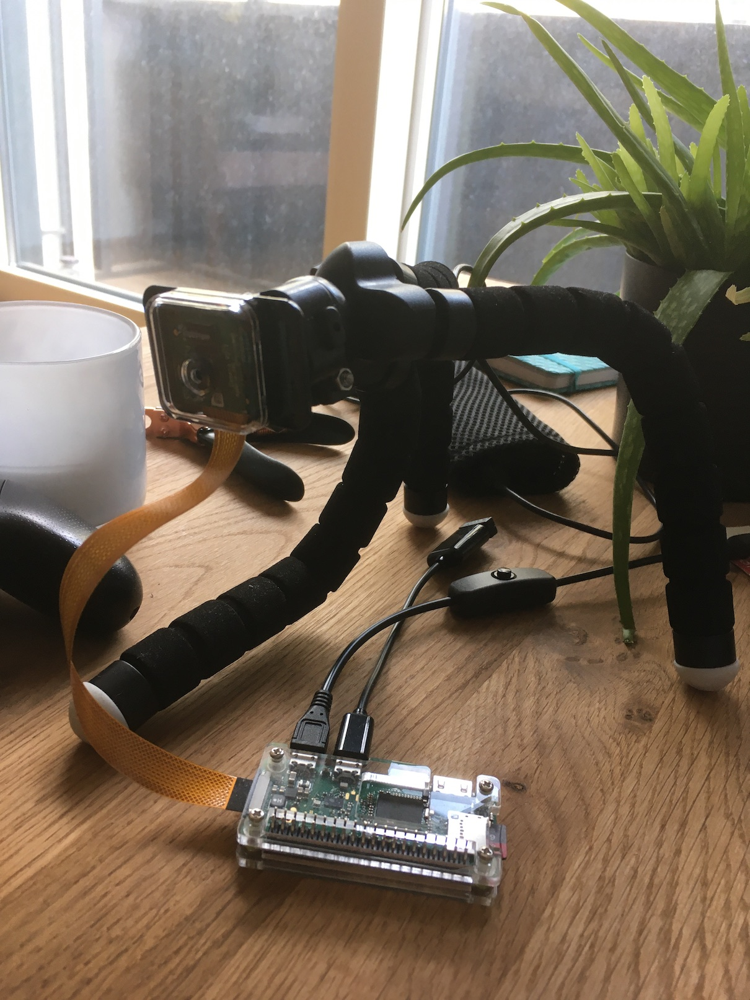
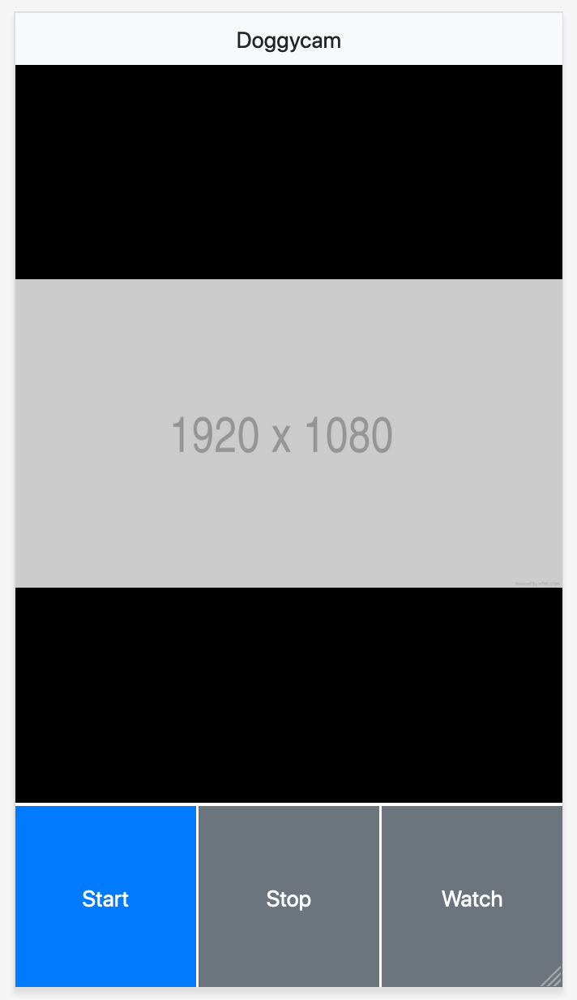

# Doggycam

A camera to check on my dog because

* it's a thing I need
* I didn't want to spend 200 quid on a consumer product
* I thought I can do this myself?
* no cloud!

Built with Pi Zero W and Raspicam v2, [Flask](https://flask.palletsprojects.com/en/1.1.x/) and [picamera](https://picamera.readthedocs.io).

| Hardware  | Web UI |
| ------------- | ------------- |
|   |   |


## Requirements

* Python 3
* [gpac](https://github.com/gpac/gpac), because `MP4Box` is used to convert H264 videos from camera to actual MP4s
* See requirements file

## Installation

(not tested)

```
sudo apt-get update
sudo apt-get install -y gpc python3 python3-pip
pip3 install -r requirements.txt
```

Then clone the repository into your home directory.

```
cd ~
git clone <this repo>
```

## Usage

```
./startuwsgi.sh
```

This starts a Flask dev server at port 5000 with a small web app in which

* you see a preview image from the camera, useful for checking it works and positioning
* you can start a video recording
* you can stop a recording video
* you can view recorded videos

A proper uWSGI server might work too but I had some problems when I tried. `start_recording` would suddenly block. Putting the camera code into a uWSGI Mule lead to the video not recording when (I assume) uWSGI C code was executed, i.e., when it blocked to wait for a message.

### Autostart

Make sure to adjust the paths and user in `startuwsgi.sh` and commands below..

**`/etc/rc.local`**

Add this to `/etc/rc.local` (prior to `exit 0`) so it's started automatically:

```
printf "Starting Doggycam"
su pi -c 'sh ~/doggycam/startuwsgi.sh >> /tmp/doggycam.log 2>&1 &'
```

**systemd**

A disadvantage of using `rc.local` is that there is no obvious way to restart or stop the doggycam, so we should use systemd instead.

1) Make a symlink to the start script in `/usr/bin`.

```
sudo ln -s $PWD/startuwsgi.sh /usr/bin/doggycam
ls -l /usr/bin/doggycam
```

2) Copy `doggycam.service` to `/etc/systemd/system/` and give it `644` permissions. Or make a symlink? Might also work and is easier to update everything with `git pull`.

3) `sudo systemctl enable doggycam`
